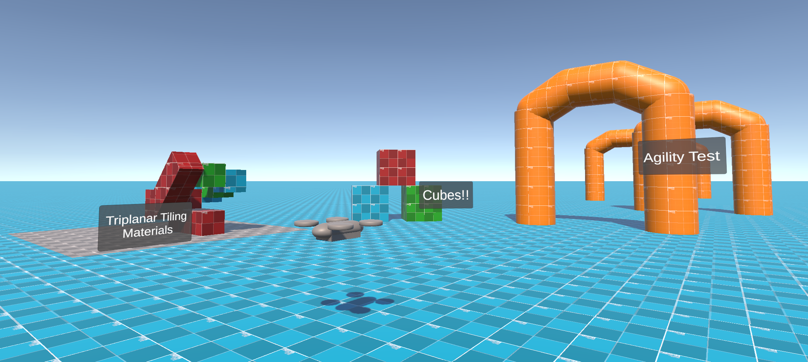

# TickleCharge DevArt Package

This package is a collection of resources to assist prototyping.

---

## Triplanar Tiling Overlay

This is a shader and base material for tiling a texture and overlay texture over a mesh.
 
[🔗 Link](Runtime/Triplanar%20Tiling%20Overlay)

Materials of this shader type can be configured to map to object, world, view and tangent space.

---

## Prototype Materials

The main prototyping materials.
 
[🔗 Link](Runtime/Prototype%20Materials)

Each tiling type includes object and world space variants.

### Prototype Tiling

`Prototype Tiling` and `Prototype Tiling Overlay` are [Triplanar Tiling Overlays](#triplanar-tiling-overlay) materials.

#### Prototype Tiling

These materials use the [Prototype textures](Runtime/Prototype%20Materials/Textures/Prototype) with no overlay layer.

#### Prototype Tiling Overlay

These materials use the Unity provided `Default-Checker-Gray` texture with a transparent
[Prototype overlay](Runtime/Prototype%20Materials/Textures/Overlay/prototype_512x512_overlay.png) texture:

### Prototype Lit

These materials use the standard lit shader.

They do not tile, and simply draw the [Prototype textures](Runtime/Prototype%20Materials/Textures/Prototype) on the mesh.

---

## Orange Grid

A very basic prototype material using an [orange grid texture](Runtime/Orange%20Grid/Textures/512X512.png).
 
[🔗 Link](Runtime/Orange%20Grid)

---

## Labels

Simple in-scene label prefab.
 
[🔗 Link](Runtime/Labels)

Uses a world-space canvas to provide the text and background a rect transform to scale from.

